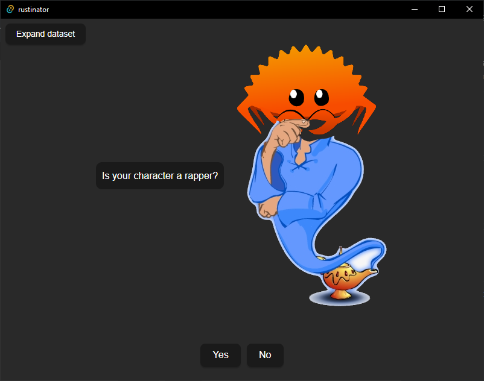

# Rustinator
[Akinator](https://akinator.com/) clone written in [Rust](https://www.rust-lang.org/) + [Tauri](https://tauri.app/) in 2 days

## How to play
1. Install [Rust](https://www.rust-lang.org/tools/install)
2. Install [Tauri](https://tauri.app/)
3. Open a `cmd`/`Terminal` in this folder.
4. Run `cd src-tauri && cargo run`
5. You're in!

## Algorithm
#### Short
The algorithm uses a series of randomly chosen questions and user responses to iteratively eliminate incorrect options, narrowing down to the correct result based on the remaining possibilities.
#### Long
The current algorithm works by randomly selecting a question and asking the user for a response. Based on the user's answer, the algorithm eliminates all options that have a conflicting answer for that question. The next questions will be randomly chosen from one of the current game state (Array) in order to avoid repeating questions. By iteratively asking questions the described way and eliminating options, the algorithm narrows down to the correct result, assuming the user answers the questions correctly.

## Dataset
The current major issue is the fact that the [dataset](https://github.com/face-hh/rustinator/tree/main/src-tauri/dataset/data.json) is very small.

- Pull requests are VERY appreciated in order to increase the dataset!
  - Click the `Expand dataset` button in the left top corner
  - Choose a character to add
  - Select all questions that apply to the character
  - Add custom question(s) or save to the dataset
  - Open a pull request with the changed dataset

## What's the point?
Content.
